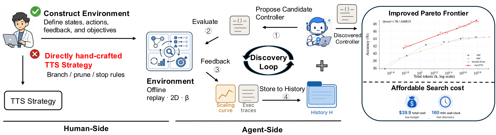
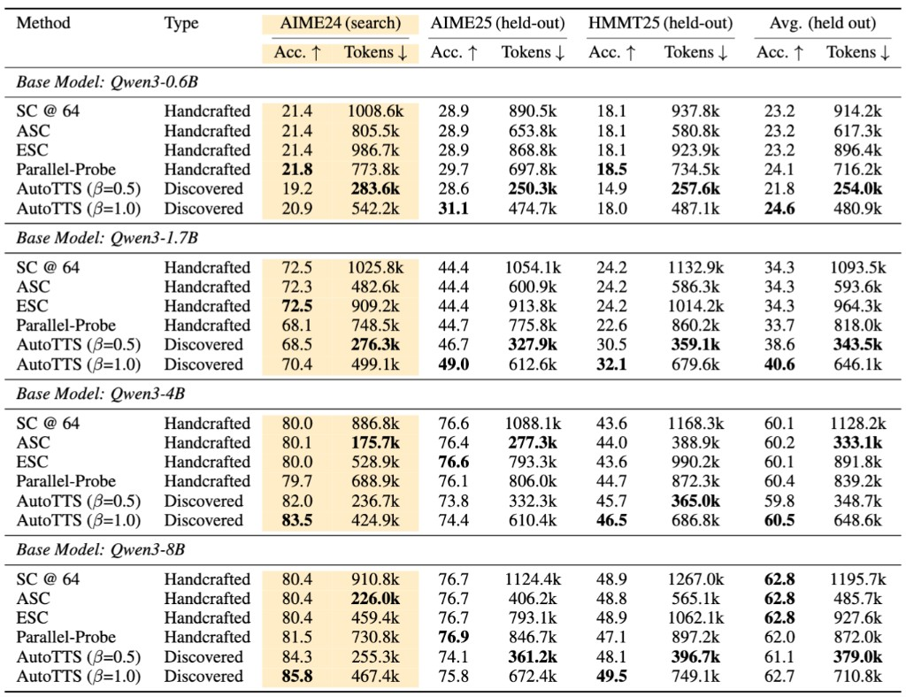
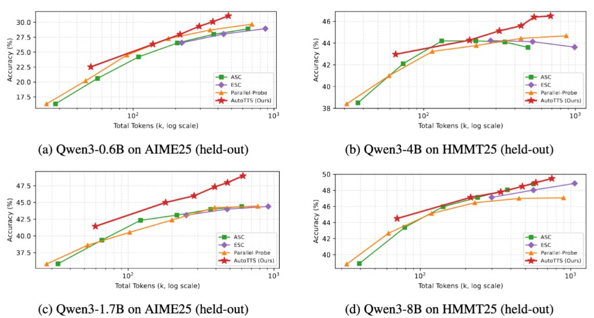
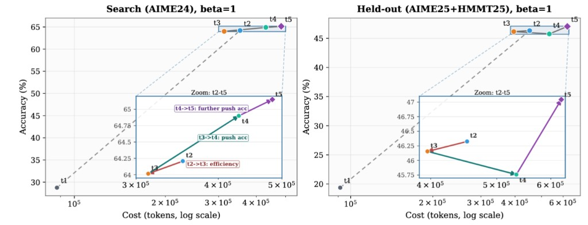

# AutoTTS

**LLMs Improving LLMs: Agentic Discovery for Test-Time Scaling**

Tong Zheng, Haolin Liu, Chengsong Huang, Huiwen Bao, Sheng Zhang, Rui Liu, Runpeng Dai, Ruibo Chen, Chenxi Liu, Tianyi Xiong, Xidong Wu, Hongming Zhang, Heng Huang
*UMD · UVA · WUSTL · UNC · Google · Meta*

[Project page](https://zhengkid.github.io/AutoTTS-web/)

<p align="center">
  
</p>

AutoTTS reframes TTS strategy design from **hand-crafting heuristics** to **environment-driven automatic search**: humans only construct an **offline replay environment** (states, actions, feedback, objectives), and a **coding agent** iteratively proposes and refines **code-defined controllers** within it — **code edits, no gradient updates**. **Cheap: 0 LLM calls, fully replay.**

**Quick links:** [Install](#install) · [Reproduction](#reproduction) · [Citation](#citation)

## Highlighted results

- ~**69.5% tokens saved** vs SC@64 at β ≈ 0.5; held-out average accuracy matches SC@64 across four backbone scales.
- **$39.9** estimated monetary cost for one full discovery run.
- **160 minutes** wall-clock for the same run.
- **0** LLM calls during discovery evaluation (replays cached segments only).

The discovered controller is the **Confidence Momentum Controller (CMC)**, characterized by trend-based stopping, coupled width–depth control, alignment-aware depth allocation, and conservative branch abandonment.

---

## Problem setup

We treat adaptive test-time inference as allocating a finite budget over branches in fixed-length intervals.

**State** at step `t`:

```text
s_t = (q, m_t, I_t, ℓ_t, Ω_t)
```

`q`: question; `m_t`: number of instantiated branches; `I_t`: active branch set; `ℓ_t`: depth vector; `Ω_t`: revealed probe triples.

**Admissible actions** `A(s_t)`:

- `BRANCH` — open a new branch through the first interval.
- `CONTINUE(i)` — advance branch `i` by one interval.
- `PROBE(i)` — reveal `ω_{i,ℓ}` without advancing depth.
- `PRUNE(i)` — deactivate branch `i`; depths and past probes stay recorded.
- `ANSWER` — terminate and apply the controller's terminal aggregator.

**Cost** in interval units:

```text
Cost(s_t) = Σ_i ℓ_{t,i} + κ_probe · |Ω_t|        (often κ_probe = 0)
```

**Objective.** A code-defined policy `π(· | s, β)` is parameterized by a scalar meta-parameter `β` that deterministically schedules every internal hyper-parameter. Over tasks `(q, y) ~ 𝒟`:

```text
max_{π, β}  E_{q,y}[ 1{ŷ_{π,β}(q) = y}  −  γ · C_{π,β}(q) ]
```

The **outer loop** searches over implementations of `π`. Each candidate is replay-evaluated on offline caches; traces and scaling curves enter the next round's history.

---

## Environment construction (run once per (model, benchmark))

The MDP above is instantiated as a concrete replay environment **before** the discovery loop starts:

1. **Specify the interface.** Fix `s_t`, `A(s_t)`, `Cost(s_t)`, and the accuracy–cost objective.
2. **Offline trajectory collection.** For each query, draw `N` parallel independent reasoning traces from the backbone (full strings first), then partition each trace into fixed-length segments of `Δ` tokens and enumerate branch prefixes `z_{i,k}` with probe responses `ω_{i,k}`.
3. **Materialize the replay store.** Every environment transition consults the archived table; e.g. `PROBE(i)` retrieves the cached `ω_{i,k}` without any new decoding.
4. **Hand off to discovery.** Candidate controllers are simulated exclusively through `observe`/`step`. Asymptotic evaluation cost is dominated by table replay.

Steps 1–3 run once. Iterative coding-agent discovery starts only after the replay store is **frozen**.

In this repository:

- `efficient_reasoning_controller/workspace/code_base/environment/` — search-set replay store.
- `efficient_reasoning_controller/test_environment/` — held-out replay store; never exposed to the proposer.

---

## Discovery: β parameterization & trace feedback

- **β parameterization.** Each candidate controller exports a single scalar `β` plus a deterministic, monotonic map from `β` to every internal knob. Outer search collapses to sweeping `β`, eliminating brittle thresholds tuned only to the search set.
- **History augmentation with execution traces.** Alongside each round's β-sweep we archive both empirical scaling curves *and* the full action-by-action trajectories reconstructed during replay. Traces give the explorer fine-grained behavioral evidence to localize defects before rewriting code.

---

## Main results

AutoTTS is optimized on AIME24 replay constructions and evaluated on held-out AIME25 / HMMT25 benchmarks across four Qwen3 backbone scales. The project page reports the following trends:

- **Better accuracy–token trade-offs.** Discovered controllers typically shift the empirical Pareto frontier beyond handcrafted baselines such as SC@64, ASC, ESC, and Parallel-Probe.
- **Held-out generalization.** Policies discovered on AIME24 transfer to held-out benchmarks, outperforming every handcrafted baseline on average accuracy for three of four backbone scales and remaining competitive on Qwen3-8B.
- **β = 0.5 operating point.** Cuts aggregate token usage by roughly **69.5%** compared with SC@64 while matching mean held-out accuracy across models.
- **β = 1.0 operating point.** Pushes peak accuracy beyond all handcrafted baselines in five of the eight tabulated comparison cells on the project page.

<p align="center">
  
</p>

Sweeping `β` traces accuracy–token scaling curves: larger `β` generally moves toward higher-budget, accuracy-first behavior, while smaller `β` favors cheaper inference.

<p align="center">
  
</p>

### Evolution of the discovery process

<p align="center">
  
</p>

The round-level trajectory (e.g., `t1 -> t5` in the figure above) shows a consistent move toward better objective values over the search process:

- On the search benchmark, later rounds improve accuracy while keeping token growth controlled, indicating progressively better policy structure rather than random fluctuation.
- On held-out benchmarks, the same trajectory remains competitive and often improves, suggesting that the discovered control logic transfers beyond the optimization split.
- The trajectory reflects **objective-seeking code evolution without gradient updates**: the agent edits explicit controller programs, receives replay-based accuracy/cost feedback, and iteratively shifts behavior toward better empirical trade-offs.

This is a key point of AutoTTS: optimization is achieved through iterative program search in a fixed replay environment, not through backpropagation or parameter fine-tuning of the backbone model.

---

## Discovered controller: CMC

The discovered controller is named the **Confidence Momentum Controller (CMC)**. Its main mechanisms are:

- **Trend-based stopping.** CMC maintains an exponential moving average of pool confidence and stops only when the confidence level is high and the trend is non-negative. This avoids stopping on transient confidence spikes.
- **Coupled width–depth control.** Widening and deepening are linked through the EMA delta: strong confidence gains suppress new branch spawning, while stagnation or regression triggers widening.
- **Alignment-aware depth allocation.** Branches whose latest answer matches the pool winner receive extra probe steps, concentrating compute on the emerging consensus while still advancing active branches.
- **Conservative branch abandonment.** A branch is abandoned only after persistently deviating for multiple rounds, and at least two active branches are preserved.

These mechanisms are implemented as code-defined controller logic and evaluated through the same replay environment as the handcrafted baselines.

<details>
<summary><b>Show full <code>OptimalController</code> source (CMC, click to expand)</b></summary>

```python
class OptimalController(LLMDesignedMethod):
    """
    Confidence Momentum Controller (CMC).

    Core idea
    ---------
    All prior proposals (IBC, SCR, DGCC) share the same fundamental stopping
    signal: "instantaneous" Beta-majority confidence computed from the
    completed-answer pool at the current step.  This is susceptible to
    single-step confidence spikes: a lucky early cluster of identical answers
    can fire the gate prematurely before the distribution has stabilised.

    CMC replaces the instantaneous confidence gate with a **momentum-aware**
    gate:
      - Track an exponential moving average (EMA) of pool confidence over
        the last `T_ema` rounds: ema_conf = alpha * conf + (1 - alpha) * ema_conf
      - Track the recent improvement delta: delta = ema_conf - ema_conf_prev
      - Gate fires when BOTH of the following hold:
          (a) ema_conf >= conf_thresh  (level requirement)
          (b) delta >= -slack          (non-deteriorating momentum; slack is
              a small tolerance that prevents stopping on a declining signal)
      This means the controller cannot stop on a one-round spike; the EMA
      must be high and not actively falling.

    Adaptive depth allocation via probe-age priority
    ------------------------------------------------
    Each active unfinished branch tracks `probe_count` (how many probe steps
    it has received).  In each round the controller allocates a per-round
    probe budget of `probe_budget` steps distributed across active branches
    using a **priority queue** sorted by probe_count descending.  The most-
    invested branches get served first (up to `burst_senior` extra steps
    each), then remaining budget goes to less-invested branches.
    This concentrates depth on branches that are closest to completion while
    still advancing younger branches, rather than uniform or purely aligned-
    biased allocation (SCR) or lazy sleeping (DGCC).

    Three-tier branch classification
    ---------------------------------
    After warm_up:
      - "aligned":  latest answer == pool_winner
      - "deviant":  latest answer != pool_winner, disagreed for >= 1 round
      - "neutral":  no pool winner yet, or first round of disagreement
    Tier affects the per-branch probe multiplier:
      aligned  -> multiplier = `burst_aligned`  (e.g. 2 at high beta)
      neutral  -> multiplier = 1
      deviant  -> multiplier = 1, but if deviant for >= `abandon_patience`
                  rounds the branch is abandoned

    Confidence-trend widening
    -------------------------
    Widening (spawning new branches) is driven by whether the confidence
    *trend* (delta) is positive and large, or weak/negative:
      - if delta > trend_thresh: confidence is accelerating -> no widening
        (we're on track to stop soon)
      - if delta <= trend_thresh: plateau or regression -> widen by
        `widen_burst` new branches, up to max_branch ceiling
    This directly couples width decision to whether deepening is yielding
    evidence-quality gains, a feedback loop not present in prior proposals.

    Beta schedule
    -------------
    All hyperparameters are deterministic functions of a single beta in [0,1].
    beta=0 -> conservative (few branches, low EMA inertia, easier to stop)
    beta=1 -> near-full budget (many branches, high inertia, harder to stop)

    Novelty vs prior work
    ---------------------
    ASC / ESC: full reads; no incremental probing.
    Parallel_Probe: fixed cohort; instantaneous majority; no pool/completion
      distinction; no EMA.
    IBC (r0001): instantaneous pool confidence gate; uniform 1-step probing;
      1-branch-per-round widening; no EMA or trend.
    SCR (r0002): asymmetric burst (aligned gets more steps); plateau-triggered
      widening; instantaneous gate; no EMA.
    DGCC (r0003): dual instantaneous gate (primary + soft corroboration);
      lazy sleeping for locked branches; vote-gap proportional widening;
      no EMA momentum.
    CMC: replaces ALL instantaneous gates with a single EMA momentum gate;
      introduces probe-age priority scheduling (neither uniform nor burst-
      aligned-only); confidence-trend widening (neither plateau nor vote-gap);
      three-tier classification is a natural simplification vs DGCC's dual
      gate without adding extra hyperparameters.
    """

    NAME = "optimal_controller"

    _MAX_BRANCH   = 64
    _MAX_OUTER    = 500

    def _schedule(self, beta: float) -> dict:
        """
        All schedules are smooth analytic functions of beta in [0,1].
        Monotonicity:
          - Parameters controlling budget use (n_init, max_branch_use,
            burst_aligned, widen_burst, warm_up, abandon_patience, T_ema)
            are NON-DECREASING in beta.
          - conf_thresh is NON-DECREASING in beta (harder to stop -> more budget).
          - trend_thresh is NON-INCREASING in beta (easier to trigger widening
            at high beta -> more budget via wider exploration).
          - ema_alpha is NON-INCREASING in beta (lower alpha = slower EMA =
            more inertia = more budget at high beta).
        """
        b = max(0.0, min(1.0, float(beta)))

        n_init           = max(2, round(2  + 6  * b))
        max_branch_use   = min(self._MAX_BRANCH, round(4 + 60 * b))
        warm_up          = max(2, round(2  + 8  * b))
        abandon_patience = max(3, round(3  + 9  * b))

        T_ema            = max(2, round(2  + 6  * b))
        ema_alpha        = 0.70 - 0.40 * b

        conf_thresh      = 0.85 + 0.12 * b
        delta_slack      = 0.04 - 0.03 * b

        burst_aligned    = max(1, round(1 + 2 * b))

        widen_burst      = max(1, round(1 + 3 * b))
        trend_thresh     = 0.04 - 0.03 * b

        min_complete     = max(2, round(2 + 3 * b))

        return {
            "n_init":           n_init,
            "max_branch_use":   max_branch_use,
            "warm_up":          warm_up,
            "abandon_patience": abandon_patience,
            "T_ema":            T_ema,
            "ema_alpha":        round(ema_alpha, 4),
            "conf_thresh":      round(conf_thresh, 4),
            "delta_slack":      round(delta_slack, 4),
            "burst_aligned":    burst_aligned,
            "widen_burst":      widen_burst,
            "trend_thresh":     round(trend_thresh, 4),
            "min_complete":     min_complete,
        }

    def __init__(self, config: Optional[Dict[str, Any]] = None):
        super().__init__(config)
        self._beta            = float((config or {}).get("beta", 0.5))
        sched                 = self._schedule(self._beta)
        self.n_init           = sched["n_init"]
        self.max_branch_use   = sched["max_branch_use"]
        self.warm_up          = sched["warm_up"]
        self.abandon_patience = sched["abandon_patience"]
        self.T_ema            = sched["T_ema"]
        self.ema_alpha        = sched["ema_alpha"]
        self.conf_thresh      = sched["conf_thresh"]
        self.delta_slack      = sched["delta_slack"]
        self.burst_aligned    = sched["burst_aligned"]
        self.widen_burst      = sched["widen_burst"]
        self.trend_thresh     = sched["trend_thresh"]
        self.min_complete     = sched["min_complete"]
        self.trace_recorder   = MethodTraceRecorder()

    def _reset_trace(self) -> None:
        self.trace_recorder = MethodTraceRecorder()

    def _trace_step(
        self,
        *,
        event: str,
        goal: str,
        step_input: Dict[str, Any],
        step_output: Any,
        state: Dict[str, Any],
        decision: str,
    ) -> None:
        self.trace_recorder.add_step(
            event=event,
            goal=goal,
            input=step_input,
            output=step_output,
            state=state,
            decision=decision,
        )

    def get_last_trace(self) -> List[Dict[str, Any]]:
        return self.trace_recorder.to_list()

    def solve_with_trace(self, question) -> Dict[str, Any]:
        answer = self.solve(question)
        return {"answer": answer, "trace": self.get_last_trace()}

    def _pool_stats(self, completed: List[str]):
        """(winner, top1, top2, conf) over completed-answer pool."""
        if not completed:
            return None, 0, 0, 0.0
        winner, top1, top2, _ = _vote_stats(completed)
        conf = _beta_majority_confidence(top1, top2)
        return winner, top1, top2, conf

    def _update_ema(self, ema_prev: float, new_val: float) -> float:
        """EMA update: ema = (1 - alpha) * ema_prev + alpha * new_val."""
        return (1.0 - self.ema_alpha) * ema_prev + self.ema_alpha * new_val

    def _classify_branch(
        self,
        br: Dict[str, Any],
        pool_winner,
        warm_enough: bool,
    ) -> str:
        if not warm_enough or pool_winner is None:
            return "neutral"
        if br["latest_ans"] == pool_winner:
            return "aligned"
        return "deviant"

    def _probe_branch(
        self,
        question,
        br: Dict[str, Any],
        completed_answers: List[str],
        n_steps: int,
    ) -> None:
        """Probe branch br for up to n_steps steps; record completions."""
        for _ in range(n_steps):
            if br["finished"]:
                break
            out = _safe_probe_more(question, br["index"])
            if out is None:
                br["finished"] = True
                if br["latest_ans"] is not None:
                    completed_answers.append(br["latest_ans"])
                break
            new_ans, is_finish = out
            br["probe_count"] += 1
            br["latest_ans"] = new_ans
            br["finished"] = is_finish
            if is_finish:
                completed_answers.append(new_ans)
                break

    def solve(self, question) -> Optional[str]:
        self._reset_trace()
        self._trace_step(
            event="start",
            goal="initialize CMC run",
            step_input={"beta": self._beta},
            step_output="initialized",
            state={
                "n_init":           self.n_init,
                "max_branch_use":   self.max_branch_use,
                "warm_up":          self.warm_up,
                "abandon_patience": self.abandon_patience,
                "T_ema":            self.T_ema,
                "ema_alpha":        self.ema_alpha,
                "conf_thresh":      self.conf_thresh,
                "delta_slack":      self.delta_slack,
                "burst_aligned":    self.burst_aligned,
                "widen_burst":      self.widen_burst,
                "trend_thresh":     self.trend_thresh,
                "min_complete":     self.min_complete,
            },
            decision="start confidence momentum controller",
        )

        # Branch state:
        #   index          : stable branch_index from probe_new
        #   latest_ans     : current answer (intermediate or final)
        #   finished       : bool — branch exhausted its full budget
        #   abandoned      : bool — dropped due to persistent deviance
        #   probe_count    : number of probe_more steps received
        #   disagree_rounds: consecutive rounds where answer != pool_winner
        branches: List[Dict[str, Any]] = []
        completed_answers: List[str] = []
        total_spawned = 0

        # ---- Phase 0: open n_init branches ----
        for _ in range(self.n_init):
            out = _safe_probe_new(question)
            if out is None:
                break
            ans, idx, is_finish = out
            total_spawned += 1
            br: Dict[str, Any] = {
                "index":           idx,
                "latest_ans":      ans,
                "finished":        is_finish,
                "abandoned":       False,
                "probe_count":     0,
                "disagree_rounds": 0,
            }
            branches.append(br)
            if is_finish:
                completed_answers.append(ans)

        self._trace_step(
            event="init_branches",
            goal="open initial branch batch",
            step_input={"n_init": self.n_init},
            step_output={
                "n_spawned":   total_spawned,
                "n_completed": len(completed_answers),
            },
            state={"total_spawned": total_spawned},
            decision="proceed to main loop",
        )

        if not branches:
            self._trace_step(
                event="finish",
                goal="return final answer",
                step_input={},
                step_output={"answer": None, "stop_reason": "no_branches"},
                state={"total_spawned": 0},
                decision="no branches available",
            )
            return None

        # EMA state — initialised to 0 (no evidence yet)
        ema_conf       = 0.0
        ema_conf_prev  = 0.0
        ema_history: List[float] = []

        outer_step = 0

        while outer_step < self._MAX_OUTER:

            # ---- Compute current pool stats ----
            pool_winner, top1, top2, pool_conf = self._pool_stats(completed_answers)
            n_complete = len(completed_answers)
            warm_enough = (outer_step >= self.warm_up)

            # ---- Update EMA ----
            ema_conf_prev = ema_conf
            ema_conf = self._update_ema(ema_conf, pool_conf)
            ema_history.append(ema_conf)
            if len(ema_history) > self.T_ema:
                ema_history.pop(0)

            if len(ema_history) >= 2:
                ema_delta = ema_history[-1] - ema_history[0]
            else:
                ema_delta = 0.0

            # ---- Classify branches and update disagree_rounds ----
            if warm_enough and pool_winner is not None:
                for br in branches:
                    if br["abandoned"] or br["finished"]:
                        continue
                    tier = self._classify_branch(br, pool_winner, warm_enough)
                    if tier == "deviant":
                        br["disagree_rounds"] += 1
                    else:
                        br["disagree_rounds"] = 0

            # ---- Abandon persistently deviant branches (keep >= 2 alive) ----
            abandoned_this: List[int] = []
            if warm_enough and pool_winner is not None:
                n_alive = sum(
                    1 for br in branches
                    if not br["abandoned"] and not br["finished"]
                )
                cands = sorted(
                    [
                        br for br in branches
                        if not br["abandoned"]
                        and not br["finished"]
                        and br["disagree_rounds"] >= self.abandon_patience
                    ],
                    key=lambda b: -b["disagree_rounds"],
                )
                max_abandon = max(0, n_alive - 2)
                for br in cands[:max_abandon]:
                    br["abandoned"] = True
                    abandoned_this.append(br["index"])

            # ---- Prioritised depth allocation ----
            active_brs = [
                br for br in branches
                if not br["abandoned"] and not br["finished"]
            ]
            active_brs_sorted = sorted(active_brs, key=lambda b: -b["probe_count"])

            probed_this: int = 0
            for br in active_brs_sorted:
                tier = self._classify_branch(br, pool_winner, warm_enough)
                n_steps = self.burst_aligned if tier == "aligned" else 1
                self._probe_branch(question, br, completed_answers, n_steps)
                probed_this += n_steps

            pool_winner, top1, top2, pool_conf = self._pool_stats(completed_answers)
            n_complete = len(completed_answers)

            ema_conf = self._update_ema(ema_conf, pool_conf)
            if ema_history:
                ema_history[-1] = ema_conf
            if len(ema_history) >= 2:
                ema_delta = ema_history[-1] - ema_history[0]
            else:
                ema_delta = 0.0

            n_active = sum(
                1 for br in branches if not br["abandoned"] and not br["finished"]
            )

            self._trace_step(
                event="forward",
                goal="probe with priority scheduling + update EMA",
                step_input={
                    "outer_step":  outer_step,
                    "pool_winner": pool_winner,
                    "pool_conf":   round(pool_conf, 4),
                },
                step_output={
                    "n_complete":    n_complete,
                    "n_active":      n_active,
                    "probed_this":   probed_this,
                    "ema_conf":      round(ema_conf, 4),
                    "ema_delta":     round(ema_delta, 4),
                    "abandoned_now": abandoned_this,
                },
                state={"total_spawned": total_spawned},
                decision="evaluate momentum gate and widening",
            )

            # ---- EMA momentum stopping gate ----
            gate_eligible = (
                warm_enough
                and n_complete >= self.min_complete
            )
            gate_fires = (
                gate_eligible
                and ema_conf >= self.conf_thresh
                and ema_delta >= -self.delta_slack
            )

            self._trace_step(
                event="terminate_check",
                goal="EMA momentum gate evaluation",
                step_input={
                    "outer_step":   outer_step,
                    "conf_thresh":  self.conf_thresh,
                    "delta_slack":  self.delta_slack,
                    "min_complete": self.min_complete,
                    "warm_up":      self.warm_up,
                },
                step_output={
                    "ema_conf":      round(ema_conf, 4),
                    "ema_delta":     round(ema_delta, 4),
                    "pool_conf":     round(pool_conf, 4),
                    "n_complete":    n_complete,
                    "gate_eligible": gate_eligible,
                    "gate_fires":    gate_fires,
                },
                state={"total_spawned": total_spawned},
                decision="stop if EMA gate fires",
            )

            if gate_fires:
                self._trace_step(
                    event="finish",
                    goal="return final answer",
                    step_input={"outer_step": outer_step},
                    step_output={
                        "answer":      pool_winner,
                        "stop_reason": "ema_momentum_gate",
                        "ema_conf":    round(ema_conf, 4),
                        "ema_delta":   round(ema_delta, 4),
                        "n_complete":  n_complete,
                    },
                    state={"total_spawned": total_spawned},
                    decision="EMA level high + momentum non-negative",
                )
                return pool_winner

            # ---- All branches resolved? ----
            all_resolved = all(br["finished"] or br["abandoned"] for br in branches)
            if all_resolved:
                break

            # ---- Confidence-trend widening ----
            can_widen = (
                total_spawned < self.max_branch_use
                and total_spawned < self._MAX_BRANCH
            )
            trend_weak = ema_delta <= self.trend_thresh
            want_widen = (
                can_widen
                and trend_weak
                and outer_step >= max(1, self.warm_up // 2)
                and ema_conf < self.conf_thresh
            )

            spawned_now = 0
            if want_widen:
                for _ in range(self.widen_burst):
                    if total_spawned >= self.max_branch_use:
                        break
                    if total_spawned >= self._MAX_BRANCH:
                        break
                    out = _safe_probe_new(question)
                    if out is None:
                        break
                    ans, idx, is_finish = out
                    total_spawned += 1
                    spawned_now += 1
                    br_new: Dict[str, Any] = {
                        "index":           idx,
                        "latest_ans":      ans,
                        "finished":        is_finish,
                        "abandoned":       False,
                        "probe_count":     0,
                        "disagree_rounds": 0,
                    }
                    branches.append(br_new)
                    if is_finish:
                        completed_answers.append(ans)

            self._trace_step(
                event="update_states",
                goal="confidence-trend widening snapshot",
                step_input={
                    "outer_step":   outer_step,
                    "want_widen":   want_widen,
                    "ema_conf":     round(ema_conf, 4),
                    "ema_delta":    round(ema_delta, 4),
                    "trend_thresh": self.trend_thresh,
                },
                step_output={
                    "spawned_now":   spawned_now,
                    "total_spawned": total_spawned,
                    "all_resolved":  all_resolved,
                },
                state={"n_active": n_active},
                decision="continue main loop",
            )

            outer_step += 1

        # ---- Final answer ----
        final_winner, _, _, final_conf = self._pool_stats(completed_answers)
        if final_winner is None:
            all_latest = [
                br["latest_ans"]
                for br in branches
                if not br["abandoned"] and br["latest_ans"] is not None
            ]
            final_winner = _majority_answer(all_latest)
            final_conf = 0.0

        self._trace_step(
            event="finish",
            goal="return final answer",
            step_input={"outer_step": outer_step},
            step_output={
                "answer":        final_winner,
                "stop_reason":   "loop_end",
                "ema_conf":      round(ema_conf, 4),
                "pool_conf":     round(final_conf, 4),
                "n_complete":    len(completed_answers),
                "total_spawned": total_spawned,
            },
            state={"total_spawned": total_spawned},
            decision="majority of completed answers at loop end",
        )
        return final_winner
```

The same source also lives in [`efficient_reasoning_controller/workspace/code_base/method.py`](efficient_reasoning_controller/workspace/code_base/method.py).

</details>

---

## Repository structure

```text
AutoTTS/
└── efficient_reasoning_controller/
    ├── eval/                         # evaluation
    ├── logs/search_history/          # Archived discovery rounds (optional method.py sources)
    ├── workspace/
    │   ├── code_base/
    │   │   ├── data_loader.py          # Replay environment (Question / Branch / ModelandTask)
    │   │   ├── method.py               # Active controller implementations
    │   │   ├── method.template.py      # Template that method.py is reset from each round
    │   │   ├── eval.py                 # Main evaluation entry point (matrix sweep)
    │   │   ├── evaluator.py            # Helper evaluation APIs
    │   │   ├── controller_api.py       # Controller base interface
    │   │   ├── trace_schema.py         # Per-step / per-problem trace schema
    │   │   ├── environment/            # Search-set replay data (per model)
    │   │   └── history/                # Seed baseline results + archived search rounds
    │   └── controller_search/
    │       ├── run_workflow.sh         # Launch the multi-round controller search
    │       ├── workflow_propose_critic.py
    │       ├── claude_proposer.py
    │       ├── codex_proposer.py
    │       └── prompts/
    └── test_environment/               # Held-out replay data (do not expose to proposer)
```

---

## Install

Depending on [how you reproduce results](#reproduction):

- **Evaluate our controllers only** — create the [Conda environment](#conda-environment) and install `numpy`, `pandas`, `tqdm` (see below). No Node.js, Claude CLI, or API keys are required for replay evaluation.
- **Run discovery yourself** — complete all subsections: Conda, [Claude environment setup](#claude-environment-setup), and [API environment setup](#api-environment-setup).

### Conda environment

```bash
conda create -n autotts python=3.12 -y
conda activate autotts
```

### Claude environment setup

```bash
curl -o- https://raw.githubusercontent.com/nvm-sh/nvm/v0.39.7/install.sh | bash

source ~/.bashrc

nvm install 21

npm install -g @anthropic-ai/claude-code

pip install claude-agent-sdk==0.1.58

pip install numpy pandas tqdm
```

### API environment setup

```bash
cat >> ~/.bashrc <<'EOF'
export OPENROUTER_API_KEY="your_openrouter_api_key"

export ANTHROPIC_BASE_URL="https://openrouter.ai/api"
export ANTHROPIC_AUTH_TOKEN="$OPENROUTER_API_KEY"
export ANTHROPIC_API_KEY=""

export ANTHROPIC_DEFAULT_SONNET_MODEL="anthropic/claude-sonnet-4.6"
export ANTHROPIC_DEFAULT_OPUS_MODEL="anthropic/claude-opus-4.6"
export ANTHROPIC_DEFAULT_HAIKU_MODEL="anthropic/claude-haiku-4.5"
export CLAUDE_CODE_SUBAGENT_MODEL="anthropic/claude-opus-4.6"
export CLAUDE_CODE_SKIP_FAST_MODE_ORG_CHECK=1
EOF

source ~/.bashrc
```

---

## Reproduction

There are **two supported workflows**:

| | **Goal** | **Needs API / Claude tooling?** |
|---|-----------|-----------------------------------|
| **Way A** | Evaluate **released or archived** TTS controller programs (`method.py`) on our replay splits | No — replay-only |
| **Way B** | **Run controller discovery yourself** (multi-round propose → critic → eval) | Yes — follow full [Install](#install) |

Complete [Install](#install) before Way B. Way A only requires the Conda setup and `numpy` / `pandas` / `tqdm`.

### Way A — Evaluate our programs (`eval/`)

Use this when you want tables and traces on the bundled replay data **without** launching search.

1. **Controller code.** The repo ships a working [`efficient_reasoning_controller/eval/method.py`](efficient_reasoning_controller/eval/method.py). To evaluate a **specific snapshot** from our search logs, copy it over that file, e.g. from [`logs/search_history/<run>/code_base/method.py`](efficient_reasoning_controller/logs/search_history) (paths may vary by release layout).
2. **Configure sweeps.** Edit models, datasets, and method lists at the top of [`eval/eval.py`](efficient_reasoning_controller/eval/eval.py).
3. **Run evaluation** from the repository root (or use `cd AutoTTS/efficient_reasoning_controller` if you are one level above the checkout):

```bash
cd efficient_reasoning_controller
python eval/eval.py
```

4. **Outputs** land under **`eval/test_results/`**, e.g. `eval/test_results/matrix_results_<MODEL>/` with `<DATASET>_raw_new_api.csv` and `<DATASET>_trace_new_api.jsonl`.

Discovery evaluation inside the research codebase uses the same logic under [`workspace/code_base/eval.py`](efficient_reasoning_controller/workspace/code_base/eval.py); it writes to `code_base/training_results/` instead. Use **`eval/`** for the standalone “evaluate what we ship” layout.

### Path B — Run discovery yourself (`workspace/`)

Use this to reproduce or extend the **automated search loop** (costs LLM calls; evaluation steps remain replay-only).

1. **Environment.** Finish [Install](#install) (Conda + nvm/Node + `claude-agent-sdk` + API exports). Authenticate the Claude Code CLI (`claude login`) as needed.
2. **Launch the workflow:**

```bash
cd efficient_reasoning_controller/workspace
bash controller_search/run_workflow.sh
```

3. **Optional tuning** via environment variables (defaults in [`run_workflow.sh`](efficient_reasoning_controller/workspace/controller_search/run_workflow.sh)):

```bash
export WORKFLOW_PROPOSER_BACKEND=claude   # claude or codex
export WORKFLOW_ROUNDS=5
export WORKFLOW_EVAL_CMD="python code_base/eval.py"
export WORKFLOW_RESUME=1
```

Each round writes a snapshot under:

```text
code_base/history/rNNNN_<timestamp>_<uid>/
├── method.py                 # OptimalController produced this round
└── proposal_results/         # CSVs + trace JSONL for this round
```

`code_base/method.py` is reset from `code_base/method.template.py` at the start of every round; each candidate must be self-contained in `method.py`.

**Evaluation during search.** `WORKFLOW_EVAL_CMD` defaults to `python code_base/eval.py`; matrices appear under `code_base/training_results/`:

```text
code_base/training_results/
└── matrix_results_<MODEL>/
    ├── <DATASET>_raw_new_api.csv
    └── <DATASET>_trace_new_api.jsonl
```

**After discovery.** Copy any round’s `method.py` into [`eval/method.py`](efficient_reasoning_controller/eval/method.py) and follow **Path A** for a standalone rerun under `eval/test_results/`.

---

## Built-in baselines

`code_base/method.py` ships:

- `ASCMethod` — adaptive self-consistency with Beta-confidence early stopping.
- `ESCMethod` — early stopping by sliding-window answer consistency.
- `Parallel_Probe` — parallel chains with warm-up, off-track pruning, and stable-majority termination.
- `OptimalController` — the target class rewritten by the search workflow (e.g. CMC).

Pre-computed seed baseline results are stored under:

```text
efficient_reasoning_controller/workspace/code_base/history/seed_algorithms/
```

---

## Citation

```bibtex
@article{zheng2026autotts,
  title  = {LLMs Improving LLMs: Agentic Discovery for Test-Time Scaling},
  author = {Zheng, Tong and Liu, Haolin and Huang, Chengsong and Bao, Huiwen and
            Zhang, Sheng and Liu, Rui and Dai, Runpeng and Chen, Ruibo and
            Liu, Chenxi and Xiong, Tianyi and Wu, Xidong and Zhang, Hongming and
            Huang, Heng},
  journal={arXiv preprint arXiv:2605.08083},
  year    = {2026}
}

@article{zheng2026parallel,
  title={Parallel-Probe: Towards Efficient Parallel Thinking via 2D Probing},
  author={Zheng, Tong and Huang, Chengsong and Dai, Runpeng and He, Yun and Liu, Rui and Ni, Xin and Bao, Huiwen and Wang, Kaishen and Zhu, Hongtu and Huang, Jiaxin and others},
  journal={arXiv preprint arXiv:2602.03845},
  year={2026}
}
```
